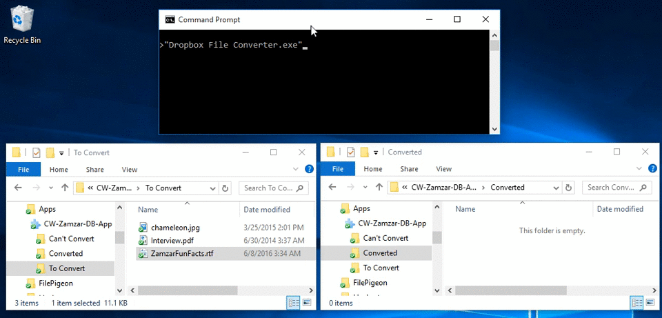
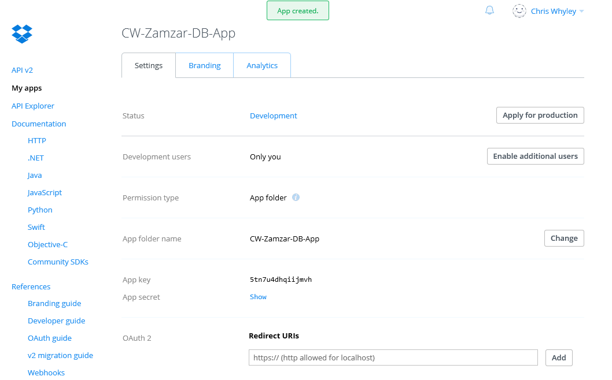
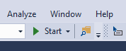

# Dropbox Converter

A sample C# app which uses the [Zamzar Developer API](https://developers.zamzar.com/) to automatically convert files in a specific Dropbox folder (named **"To Convert"**) into different formats. Converted files are placed in Dropbox in an output folder named **"Converted"**. A simple JSON file (`dropbox_file_converter_config.json`) is used to manage file conversion preferences (i.e. what formats to convert from and to).

This code is aimed at Developers interested in using the Zamzar file conversion API with Dropbox. If you find any issues please raise them against this repository, since it is monitored by the Zamzar development team. We welcome pull requests, forks and suggestions for improvements. 

This code is licensed under the [MIT License](License) - we encourage you to take this code and develop on top of it.

Check it:



## Assumptions

We assume that you:

* Are a developer with some experience using Visual Studio to develop C# applications.
* Are already in possession of a Dropbox account (if not [signup here](https://www.dropbox.com/)).


## Getting Started

To get started with this project:

### Clone this repository:

    git clone https://github.com/zamzar/zamzar-samples-dropbox-converter

### Open in Visual Studio

If you already have a version of Visual Studio installed on your computer, please skip to step 5, otherwise follow the steps below:

1. Go to [https://www.visualstudio.com/](https://www.visualstudio.com/)
2. Click the **Download Community 2015** button near the top of the page.
3. Wait for the file to download and then run it.
4. Follow the instructions provided to you until Visual Studio is installed on your computer.
5. Open the folder for this program and open the **Dropbox File Converter.sln** file in Visual Studio.
6. Wait a short while, and you should be presented with the source code for the program.

### Setup a Dropbox app

For the program to access a users Dropbox account, a Dropbox app is needed. To create one:

1. Go to [https://www.dropbox.com/developers/apps/create](https://www.dropbox.com/developers/apps/create)
2. Choose 'Dropbox API' as the API.
3. Choose 'App Folder' as the type of access.
4. Name your app whatever you wish and click the create button. You should be taken to your new app dashboard. It should be noted that app names are unique across all accounts, so your app name should be something specific to you.
5. Note down the Dropbox app key and secret, as you'll need these shortly.

Your app in Dropbox should look like something like this:



### Obtain a Zamzar API key

This program uses the [Zamzar file conversion API](https://developers.zamzar.com/) to perform file conversions. Because of this, a Zamzar account and API key are required to use it. To get an API key:

1. Go to [https://developers.zamzar.com/pricing](https://developers.zamzar.com/pricing)
2. Choose whatever plan fulfills your needs and click the corresponding 'Sign Up' button.
3. Fill in your credentials, agree to the terms & privacy policy, and click the continue button.
4. You will now be taken to your account dashboard, where you can see your plan and API Key.
5. Not down the Zamzar API key from your account dashboard, as you'll need this shortly.

## Configuration

To tell Dropbox what files we wish to convert to what formats we use a configuration file called `dropbox_file_converter_config.json` , which can be edited to your needs.

This file contains:

* A Dropbox app key and secret, which you obtained when setting up your Dropbox app.
* A Zamzar API key, which you obtained when signing up for a Zamzar API account.
* The access key used by the program to access the user's Dropbox app folder.
* A list of all supported file types by Zamzar, and what the user wishes them to be converted to.

### Copy the config file

Make sure you copy the `dropbox_file_converter_config.json` file **to the same directory as your program executable**, otherwise you will receive a `"Config file not found!"` error.

When running in Visual Studio copy `dropbox_file_converter_config.json` to `ROOT_DIR\src\Dropbox File Converter\bin\Debug`

### Edit the config file

You should modify fields in `dropbox_file_converter_config.json`. First, add the necessary fields for access to the Dropbox and Zamzar APIs:

```
    "zamzar_api_key" : "yourZamzarApiKey",
    "dropbox_api_key" : "yourDropboxAppKey",
    "dropbox_api_secret" : "yourDropboxSecret",
```

Next, update the config to make the program perform the conversions you require. For example, the following snippet:

    "png":"png",

Can be changed to:

    "png":"jpg",
    
This change will make the program convert any png image in the "To Convert"" folder in Dropbox into a jpg image, which is then stored in the "Converted" Folder in Dropbox.

## Running the program

To run the program, simply click the green arrow button labelled 'Start' on the toolbar in visual studio, or press f5.



The program should open in a console window, but doesn't always open in the foreground. You may need to click the icon for it in your taskbar for the console window to appear.

### Obtaining an access key

When the program is run for the first time, a webpage will be opened up in the users default browser, requesting that they log into Dropbox to authorise the app. If the user allows this app, then they will be provided with a code that they can paste back into the program console window, which will allow the program to access the users Dropbox. This access key is then saved to the 'dropbox_file_converter_config.json' file for later use, so the program does not have to repeat the first step in future.

### Performing file conversions

When the user has obtained an access key and the program has gained access to their Dropbox account, the program will create a folder for itself in the users 'Apps' folder in Dropbox. The program will then create 3 sub-folders of this new folder.

**To Convert** - Every file placed in this folder will be detected by the program, which will then attempt to convert it into the target format that the user has specified in the `dropbox_file_converter_config.json` file.

**WARNING: All files placed in this folder WILL BE DELETED after they have been converted, so make sure you have another copy of the original somwhere else !**

**Converted** - When a file conversion has been performed successfully, the resultant file will be placed into this folder. If more than one file is produced (e.g converting a Powerpoint presentation into a series of JPG files), a sub-folder will be created in this folder instead, and all converted files will be placed inside it.

**Can't Convert** - When a file conversion can't take place for any reason (e.g. the target format specified by the user is invalid, or the target format is the same as the source format), then the file will be placed in this folder.

When the program has confirmed the existence of these three folders, it will enter an infinite loop, where it will **check the "To Convert" folder every three seconds** until it finds a file, which it will then try to convert.

